# SIMPACT

**[SIMPACT: Simulation-Enabled Action Planning using Vision-Language Models](https://arxiv.org/abs/2512.05955)**

Haowen Liu\*, Shaoxiong Yao\*, Haonan Chen, Jiawei Gao, Jiayuan Mao, Jia-Bin Huang, Yilun Du
CVPR 2026 · \*equal contribution

[**Project page**](https://simpact-bot.github.io/) · [**Paper (arXiv)**](https://arxiv.org/abs/2512.05955) · [**PDF**](https://arxiv.org/pdf/2512.05955)

Official implementation. SIMPACT is a **test-time** framework that equips a
vision-language model with physical reasoning through **simulation-in-the-loop
world modeling** — no additional training. From a **single RGB-D observation** it
constructs a physics simulation (real2sim), lets the VLM propose actions, observes
simulated rollouts, and iteratively refines the plan in a physically grounded way
(**propose → rollout → verify ↔ regress**), across rigid-push / rope / dough /
sweep tasks.

## Results — bundled reference runs

One committed, **independently re-verified** run per task (`examples/*/<trial>/runs/`);
the "before"/"after" frames below are the exact renders the VLM verifier saw.

| | push | rope | dough | sweep |
|---|---|---|---|---|
| **real capture** | 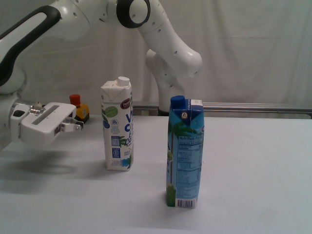 | 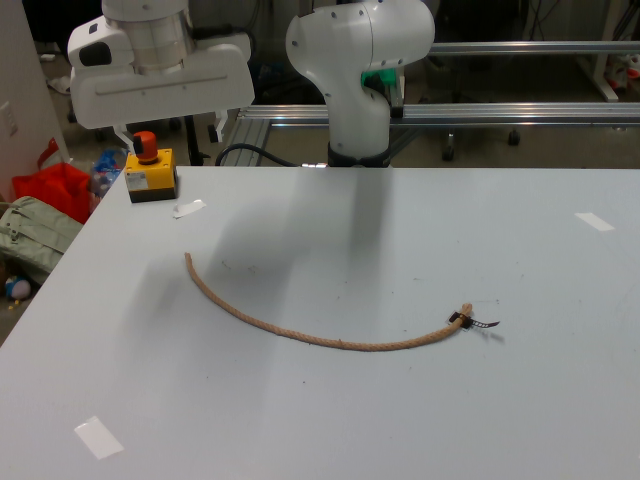 | 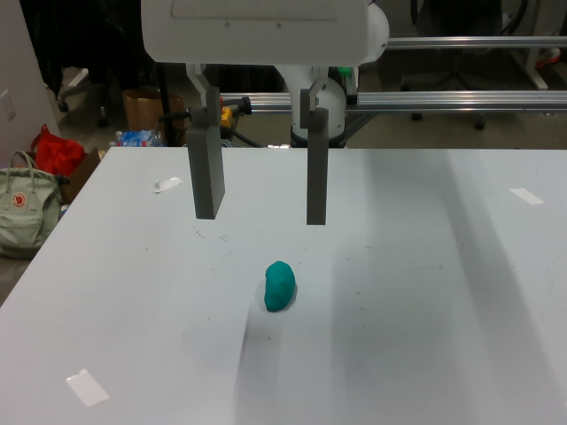 | 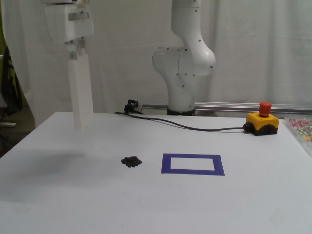 |
| **sim, before** | 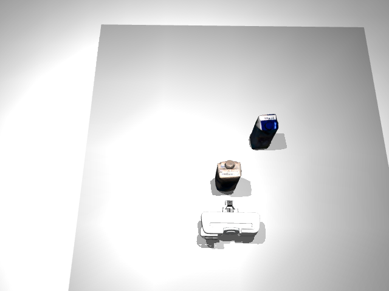 | 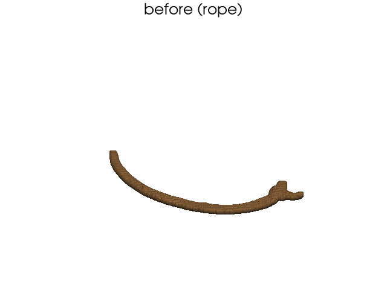 | 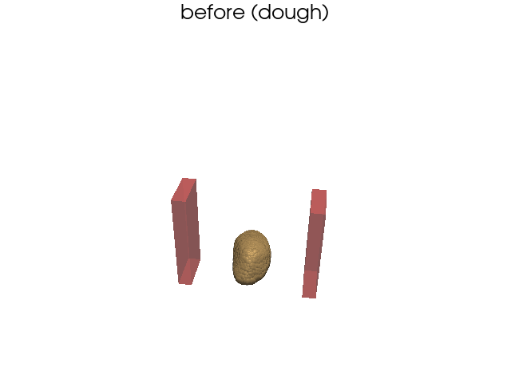 | 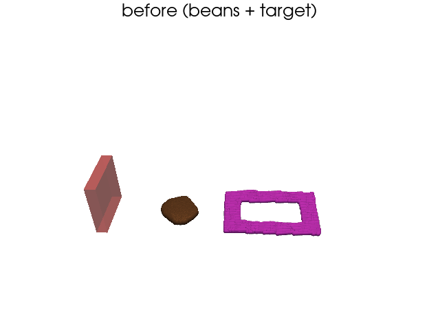 |
| **sim, verified after** | 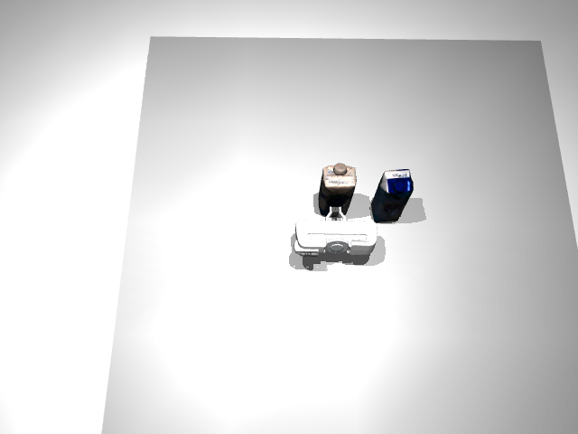 | 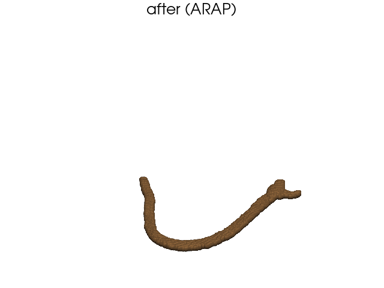 | 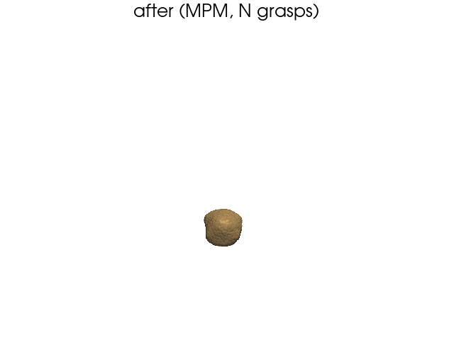 | 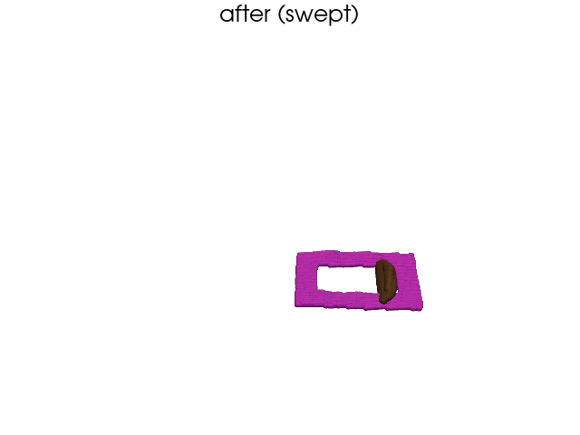 |
| outcome | cartons aligned side-by-side (measured gate AND VLM) · [video](examples/push_real2sim/0103_push_0/runs/final_rollout/rollout_00.mp4) | free end dragged into a U-curve (VLM-verified) · [video](examples/rope_real2sim/1102_rope_11/runs/final_rollout/rollout_00.mp4) | square footprint via two perpendicular squeezes (VLM-verified) · [video](examples/dough_real2sim/1104_sand_6/runs/final_rollout/rollout_00.mp4) | pile swept into the target at full coverage (measured gate AND VLM) · [video](examples/sweep_real2sim/0118_sweep_0/runs/final_rollout/rollout_00.mp4) |

Details, per-task notes, and the trial data layout: [examples/README.md](examples/README.md).
Replay any recorded plan (no VLM calls) with
[`replay_rollout.py`](scripts/replay_rollout.py).

## Setup

```bash
uv sync --extra dev            # builds .venv (Python 3.11); run everything with `uv run`
cp .env.example .env           # then set the vars below
```

- `GOOGLE_API_KEY` — required by every VLM step (propose/verify/regress, rope endpoint
  grounding, material-ID).
- MPM loops (dough/sweep) need **CUDA + warp**; run renders headless with `MUJOCO_GL=egl`.
- **Segmentation / deformable scene rebuilds** need only the SAM2 checkpoint
  (`SIMPACT_SAM2_CHECKPOINT`, ~900 MB — a Grounded-SAM-2 repo clone is *optional*:
  GroundingDINO loads from `transformers` and SAM2 from the `sam2` wheel).
- **The full push perception** (Grounded-SAM-2 → SAM-3D → FoundationPose) has its own
  install guide: [docs/RIGID_ENV_SETUP.md](docs/RIGID_ENV_SETUP.md)
  (`bash scripts/setup_rigid_env.sh`). Not needed to run the bundled examples —
  every trial ships with its built scene. The script builds **one env** that also
  includes the `dev` extras, so the same env runs the full reproduce (rigid
  perception + deformable/MPM + planning).
- **After `setup_rigid_env.sh`, never run a bare `uv sync` (or `--extra dev`
  alone)** — an exact sync prunes the rigid extras and the source-built deps
  (sam2, pytorch3d, nvdiffrast, kaolin, the FoundationPose exts). To re-sync, use
  `uv sync --extra rigid --extra dev`, then re-run the script (idempotent, cheap).

## Reproduce everything (`reproduce_all.sh`)

One script regenerates the results above: tests + real2sim + all four closed loops,
**auto-detecting** prerequisites and **skipping** (never failing) any stage whose
inputs are missing. It reads inputs only from `examples/` (and an optional
`PUSH_DATA`) — never an external checkout.

```bash
bash scripts/reproduce_all.sh                     # everything the machine can run
bash scripts/reproduce_all.sh --tasks dough,sweep # only some tasks
uv run pytest tests/ -q
```

| flag / env | effect |
|---|---|
| `--tasks LIST` | comma list of `push,rope,dough,sweep` to run (default: all four) |
| `--out-dir DIR` | output root (default: a **timestamped** scratch dir, so reruns never overwrite) |
| `--force` | reuse a non-empty `--out-dir` (else the run aborts to protect existing outputs) |
| `--overwrite-examples` | write into the committed `examples/*/<trial>/runs` instead of scratch |
| `--skip-tests` / `--skip-real2sim` / `--skip-planning` | skip a whole stage |
| `--skip-perception` / `--full-perception` | never / force the rigid-body perception (default: auto) |
| `--full-real2sim` | plan rope/dough/sweep on scenes **rebuilt from `capture/`** (default: rebuild is verify-only) |
| `--quick` | fewer iters/steps for a fast smoke |
| `PUSH_DATA=<dir>` (env) | reconstructed push-scene assets (meshes + poses); see below |

**What runs, and what each task needs:**
- **rope / dough / sweep** — fully bundled in `examples/`; run out of the box (dough/sweep
  need CUDA + warp; all planning needs `GOOGLE_API_KEY`). Each trial's `capture/` carries
  the complete raw RGB-D + EE record, so when Grounded-SAM-2 + the SAM2 checkpoint are
  detected the script also **rebuilds every scene from capture/** and verifies it against
  the committed `sim/` — and with `--full-real2sim` plans on the rebuilt scene, i.e. the
  exact pipeline an end user runs from a fresh capture
  (`python -m simpact.real2sim.build_scene --raw-dir <trial>/capture ...` then
  `scripts/optimize.py --task <t> --scene <trial>`).
- **push** — also fully bundled: the trial's `sim/` carries the **golden reconstruction**
  (SAM-3D textured meshes + FoundationPose poses), so push planning runs out of the box
  too. When the external perception models (SAM-3D + FoundationPose + SAM2 ckpt) are
  detected, the script additionally **rebuilds the scene from the example RGB-D and
  verifies it** against that reference — and with `--full-real2sim` plans on the fresh
  reconstruction. `PUSH_DATA` optionally overrides with your own assets dir.

## Step 1 — real2sim: build a scene from recorded RGB-D

This is the paper's world-model construction step: one RGB-D observation → a
simulatable scene. (The bundled examples already ship with built scenes — run this
only for fresh captures.)

**Rigid** (segment → SAM-3D mesh → FoundationPose 6-DoF → MuJoCo scene):

```bash
uv run python scripts/run_rigid_pipeline.py \
  --data_dir <recorded_trial> --objects "pringles. white coconut milk carton." \
  --cam 1 --out_dir /tmp/rigid_demo --xml /tmp/rigid_demo/scene.xml
```

**Deformable** (segment → back-project → column-fill / rope endpoints → VLM material-ID):

```bash
# dough
uv run python -m simpact.real2sim.build_scene --raw-dir <trial>/capture \
  --out-dir <trial>/sim --material dough --object "blue playdoh" --profile 1026
# sweep  (--bg is the target-region prompt)
uv run python -m simpact.real2sim.build_scene --raw-dir <trial>/capture \
  --out-dir <trial>/sim --material sweep --object "black bean pile" \
  --bg "taped target region" --profile 0103
# rope
uv run python -m simpact.real2sim.build_scene --raw-dir <trial>/capture \
  --out-dir <trial>/sim --material rope --object "rope" --profile 1026
```

Output is a self-contained scene dir (cloud + `scene.yaml`; rope also `context.txt`).
Calibration resolves per scene from `scene.yaml`'s `camera: {profile}` → `assets/calibration/`.

## Step 2 — VLM optimization loop: propose → rollout → verify ↔ regress

The paper's simulation-in-the-loop planning: each command runs the closed loop on a
scene and writes proposals + the refined plan to `--out_dir` (`propose.json`,
`refined_plan.json`, rollout renders/mp4s). The `--scene` examples below ship in the
repo, so these commands run without Step 1.

```bash
# Rigid push (MuJoCo; measured alignment gate)
uv run python scripts/optimize.py --task push \
  --scene examples/push_real2sim/0103_push_0 \
  --instruction "Push the white carton so it lines up side by side with the blue carton." \
  --align_axis y --align_tol 0.02 --out_dir /tmp/loop_demo

# Dough — multi-grasp squeeze (MPM; VLM shape judgment)
MUJOCO_GL=egl uv run python scripts/optimize.py --task dough \
  --scene examples/dough_real2sim/1104_sand_6 \
  --instruction "Shape the dough into a square block by squeezing from two perpendicular directions." \
  --max_iters 3 --out_dir /tmp/dough_loop

# Sweep — pusher into target (MPM; measured coverage gate)
MUJOCO_GL=egl uv run python scripts/optimize.py --task sweep \
  --scene examples/sweep_real2sim/0118_sweep_0 \
  --instruction "Sweep the pile of beans into the taped target region." \
  --min_coverage 0.5 --max_iters 3 --out_dir /tmp/sweep_loop

# Rope — drag the free end (ARAP; VLM shape judgment)
uv run python scripts/optimize.py --task rope \
  --scene examples/rope_real2sim/1102_rope_11 \
  --instruction "Arrange the rope into a U-shaped curve by dragging its free end." \
  --max_iters 3 --out_dir /tmp/rope_loop
```

More detail: [examples/README.md](examples/README.md) (the bundled trials, layout,
and per-task notes),
[docs/RIGID_PIPELINE.md](docs/RIGID_PIPELINE.md),
[docs/DEFORMABLE_INTEGRATION.md](docs/DEFORMABLE_INTEGRATION.md),
[docs/EVALUATION.md](docs/EVALUATION.md).

## Citation

If you find SIMPACT useful, please cite:

```bibtex
@InProceedings{liu2026cvpr,
    author    = {Liu, Haowen and Yao, Shaoxiong and Chen, Haonan and Gao, Jiawei and Mao, Jiayuan and Huang, Jia-Bin and Du, Yilun},
    title     = {SIMPACT: Simulation-Enabled Action Planning using Vision-Language Models},
    booktitle = {Proceedings of the IEEE/CVF Conference on Computer Vision and Pattern Recognition (CVPR)},
    month     = {June},
    year      = {2026},
    pages     = {20790-20801}
}
```
